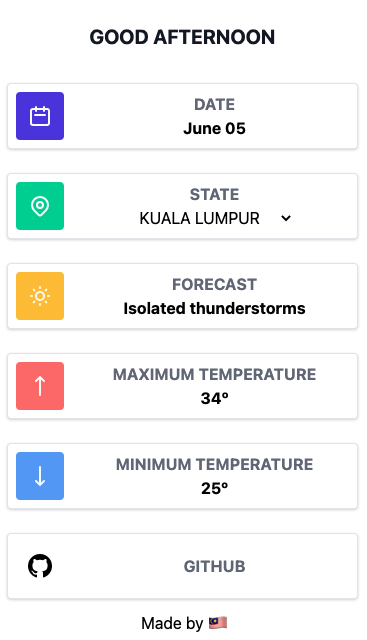

# README

# CUACA
"[Cuaca](http://www.cuaca.io)" came from "Malay" words, which bring the meaning of weather 🌤 🌧 🌩

This site is using [MET Malaysia API](https://api.met.gov.my/).

# Contribution
You are welcome to contribute to this project! Send in a PR 😆

Just an idea for contribution, you may add in spec, rubocop, add up new feature, or improving the current code / UI UX!

## Pre-installation
This project is fully run on Ruby on Rails and [tailwind](https://tailwindcss.com/). Make sure that you have the following installed in you machine or docker:

```
Ruby version 2.7.1
```

Since I could not share the `master.key` you may register the API yourself. Here is the example of the key am using in this Project.

```
met:
  url:
  token:
```
Once you have registered, you may add your keys value accordingly.

### Screenshot:


